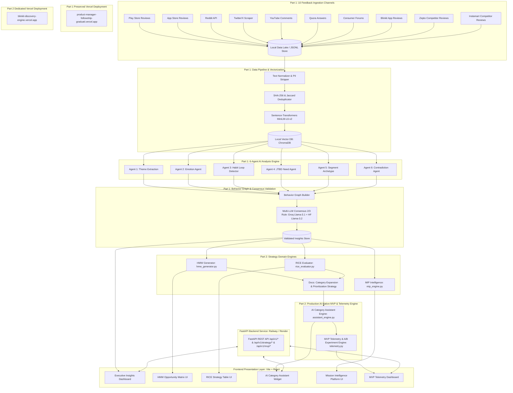

# Architecture: AI-Powered Discovery Engine & AI-Native MVP — Blinkit Category Exploration

This document describes the end-to-end system architecture for the **Blinkit Category Exploration Graduation Project**, covering both **Part 1 (AI-Powered Discovery Engine)** and **Part 2 (Product Strategy & Production AI-Native MVP)**. It is derived directly from [context.md](file:///c:/Nextleap%20Projects%20Git/ProductManagerFellowshipGraduationProject/docs/context.md), [problemstatement.md](file:///c:/Nextleap%20Projects%20Git/ProductManagerFellowshipGraduationProject/docs/problemstatement.md), and [deployment-plan.md](file:///c:/Nextleap%20Projects%20Git/ProductManagerFellowshipGraduationProject/docs/deployment-plan.md).

---

## 1. Executive Architecture Summary & Design Goals

The platform is designed as a decoupled, multi-tier intelligence architecture consisting of two primary operational domains:

* **Part 1 Architecture — AI Discovery Engine (Backend Intelligence):** Scrapes 10 customer feedback channels (157,630 raw feedback corpus), normalizes and vectorizes records into a local ChromaDB vector index, executes a **6-Agent AI Analysis Layer**, constructs an interconnected **Behavior Graph**, and enforces a **4-Tier Quality Validation Engine** (Groq Llama-3.1 + HuggingFace Llama-3.2 Multi-LLM Consensus 2/3 Rule, statistical confidence scoring, 200-review human audit benchmark, 20 user interviews).
* **Part 2 Architecture — Strategy Domain Engine & AI-Native MVP (Production Application & Design System):** Translates validated Part 1 insights into:
  - **HMW Opportunity Framing Engine (`src/app/strategy/hmw_generator.py`)** generating 6 structured HMW opportunity areas.
  - **RICE Prioritization Engine (`src/app/strategy/rice_evaluator.py`)** scoring 4 solution candidates and ranking **AI Category Assistant** as #1 (RICE Score: 720.0).
  - **AI Category Discovery Assistant Engine (`src/app/strategy/assistant_engine.py`)** serving contextual trial recommendations, dynamic nudges, and smart trial bundles.
  - **Mission Intelligence Platform Engine (`src/app/strategy/mip_engine.py`)** compiling multi-channel strategic intelligence.
  - **MVP Telemetry & A/B Experimentation Engine (`src/app/mvp/telemetry.py`)** monitoring North Star Metric, secondary metrics, guardrails, and A/B variants in real-time.
  - High-fidelity UI mockups and layout tokens anchored in **`designsystem/`** (`screen.png`, `screen1.png`, `screen2.png`, `screen3.png`).

### 1.1 Dual-Link Isolated Deployment Policy

> [!IMPORTANT]
> **Production Link Isolation:**
> - **Part 1 Live Intelligence Dashboard Link (PRESERVED / UNTOUCHED):** [https://product-manager-fellowship-graduati.vercel.app/](https://product-manager-fellowship-graduati.vercel.app/)
> - **Part 2 Live AI-Native MVP Link (SEPARATE DEDICATED DEPLOYMENT):** [https://blinkit-discovery-engine.vercel.app/](https://blinkit-discovery-engine.vercel.app/) (Separate Vercel project deployment).

---

## 2. End-to-End System Architecture

---

## 3. Part 1 System Components (AI Discovery Engine)

- **Ingestion & Vector DB:** Python async scrapers parsing 10 feedback channels $\rightarrow$ ChromaDB vector collection.
- **6-Agent Intelligence Layer:** Theme, Emotion, Habit Loop, JTBD, Segment Archetype, Contradiction detection.
- **Consensus & Graph:** 30-Node Behavior Graph $\rightarrow$ Multi-LLM 2/3 Consensus Validation.
- **Part 1 Live URL (Preserved):** [https://product-manager-fellowship-graduati.vercel.app/](https://product-manager-fellowship-graduati.vercel.app/)

---

## 4. Part 2 System Components (Strategy Domain & AI-Native MVP)

### 4.1 Strategy Domain Backend Engine (`src/app/strategy/`)
1. **`rice_evaluator.py`**: Evaluates Reach, Impact, Confidence, Effort across solutions (AI Assistant, Trial Bundles, Contextual Nudges, Social Badges).
2. **`hmw_generator.py`**: Generates 6 HMW opportunity categories mapped directly to validated user habit loops and friction points.
3. **`mip_engine.py`**: Aggregates platform strategic intelligence, category memos, and executive briefs.
4. **`assistant_engine.py`**: Handles user query parsing, contextual cross-category matching, dynamic discount allocation, and prompt suggestions.

### 4.2 MVP Telemetry & A/B Testing Engine (`src/app/mvp/telemetry.py`)
- Tracks North Star Metric (% MAC purchasing $\ge 1$ new category/month), Secondary metrics (cross-category conversion, basket size expansion, retention), and Guardrail metrics (SLA compliance, cart abandonment, nudge fatigue).
- Manages A/B variant traffic splitting: Control (Standard UI, 33%), Variant A (AI Assistant Widget, 34%), Variant B (Smart Trial Bundles, 33%).

### 4.3 Strategy REST API Contracts
- `GET /api/v1/strategy/hmw-matrix`: Returns array of 6 HMW opportunity areas.
- `GET /api/v1/strategy/rice-table`: Returns RICE scoring table for all 4 solutions.
- `GET /api/v1/strategy/mip-report`: Returns compiled strategic intelligence report.
- `POST /api/v1/strategy/assistant`: Accepts `{query, current_category}` and returns contextual AI recommendations.
- `GET /api/v1/mvp/telemetry`: Returns real-time A/B metrics, North Star, secondary, and guardrail telemetry.
- `POST /api/v1/mvp/telemetry/event`: Logs interactive telemetry events (`nudge_viewed`, `nudge_clicked`, `trial_added_to_cart`, `cross_category_checkout`).

---

## 5. Dual-Link Isolated Deployment Policy

> [!IMPORTANT]
> **Production Link Isolation Policy:**
> - **Part 1 Link (Preserved / Untouched):** [https://product-manager-fellowship-graduati.vercel.app/](https://product-manager-fellowship-graduati.vercel.app/)
> - **Part 2 Link (Separate Dedicated Vercel Project):** [https://blinkit-discovery-engine.vercel.app/](https://blinkit-discovery-engine.vercel.app/)

---

*Derived from [context.md](file:///c:/Nextleap%20Projects%20Git/ProductManagerFellowshipGraduationProject/docs/context.md), [problemstatement.md](file:///c:/Nextleap%20Projects%20Git/ProductManagerFellowshipGraduationProject/docs/problemstatement.md), and [deployment-plan.md](file:///c:/Nextleap%20Projects%20Git/ProductManagerFellowshipGraduationProject/docs/deployment-plan.md)*

