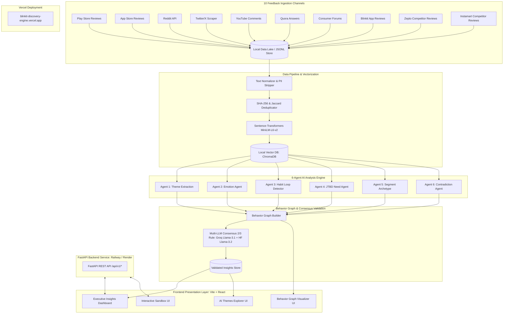

# Architecture: AI-Powered Discovery Engine — Blinkit Category Exploration

This document describes the end-to-end system architecture for the **Blinkit AI Discovery Engine Graduation Project**. It is derived directly from [context.md](file:///c:/Nextleap%20Projects%20Git/ProductManagerFellowshipGraduationProject/docs/context.md), [problemstatement.md](file:///c:/Nextleap%20Projects%20Git/ProductManagerFellowshipGraduationProject/docs/problemstatement.md), and [deployment-plan.md](file:///c:/Nextleap%20Projects%20Git/ProductManagerFellowshipGraduationProject/docs/deployment-plan.md).

---

## 1. Executive Architecture Summary & Design Goals

The platform is designed as a multi-tier intelligence architecture for customer insight synthesis:

* **AI Discovery Engine (Backend Intelligence):** Scrapes 10 customer feedback channels (157,630 raw feedback corpus), normalizes and vectorizes records into a local ChromaDB vector index, executes a **6-Agent AI Analysis Layer**, constructs an interconnected **Behavior Graph**, and enforces a **4-Tier Quality Validation Engine** (Groq Llama-3.1 + HuggingFace Llama-3.2 Multi-LLM Consensus 2/3 Rule, statistical confidence scoring, 200-review human audit benchmark, 20 user interviews).
* **Executive Intelligence Dashboard (Frontend Application):** Interactive React dashboard displaying validated insights, behavior graphs, research question filters, and live single-inference sandbox analysis.

---

## 2. End-to-End System Architecture

---

## 3. Core System Components

### 3.1 AI Discovery Engine Backend
- **Ingestion & Vector DB:** Python async scrapers parsing 10 feedback channels $\rightarrow$ ChromaDB vector collection (`src/app/api/data_loader.py`).
- **6-Agent Intelligence Layer:** Theme, Emotion, Habit Loop, JTBD, Segment Archetype, Contradiction detection (`src/app/agents/`).
- **Consensus & Graph:** 30-Node Behavior Graph $\rightarrow$ Multi-LLM 2/3 Consensus Validation (`src/app/analysis/`).

### 3.2 Executive Intelligence Dashboard
- Interactive React dashboard (`frontend/src/components/ExecutiveSummary.jsx`, `BehaviorGraphView.jsx`, `ConsensusReportModal.jsx`).

---

## 4. Production Deployment & Live Platform

> **Live Production Platform:** [https://blinkit-discovery-engine.vercel.app/](https://blinkit-discovery-engine.vercel.app/)

---

*Derived from [context.md](file:///c:/Nextleap%20Projects%20Git/ProductManagerFellowshipGraduationProject/docs/context.md), [problemstatement.md](file:///c:/Nextleap%20Projects%20Git/ProductManagerFellowshipGraduationProject/docs/problemstatement.md), and [deployment-plan.md](file:///c:/Nextleap%20Projects%20Git/ProductManagerFellowshipGraduationProject/docs/deployment-plan.md)*

