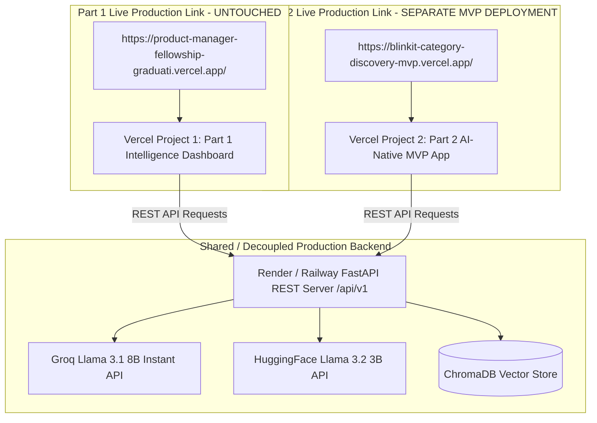

# Production Deployment Guide: Blinkit AI Discovery Engine & AI-Native MVP

This document provides a comprehensive, step-by-step guide for deploying, configuring, securing, and maintaining the **Blinkit Category Exploration Project**. It aligns directly with [context.md](file:///c:/Nextleap%20Projects%20Git/ProductManagerFellowshipGraduationProject/docs/context.md), [architecture.md](file:///c:/Nextleap%20Projects%20Git/ProductManagerFellowshipGraduationProject/docs/architecture.md), and [implementation-plan.md](file:///c:/Nextleap%20Projects%20Git/ProductManagerFellowshipGraduationProject/docs/implementation-plan.md).

---

## 1. Executive Deployment Strategy & Dual-Link Isolation Policy

To guarantee continuous stability and avoid breaking existing fellowship evaluation setups, the project strictly enforces a **Dual-Link Isolated Deployment Architecture**:

> [!IMPORTANT]
> **Production Deployment Policy:**
> - **Part 1 Live Link (UNTOUCHED / PRESERVED):** `https://product-manager-fellowship-graduati.vercel.app/`  
>   *(Serves Part 1 AI Discovery Engine, 10-channel analysis, Behavior Graph, 6 AI Agents, and Multi-LLM Consensus report. This link will NOT be clubbed, modified, or disturbed).*
> - **Part 2 Live Link (SEPARATE DEDICATED MVP DEPLOYMENT):** A distinct, isolated Vercel project deployment (e.g., `https://blinkit-category-discovery-mvp.vercel.app/`).  
>   *(Serves Part 2 AI-Native MVP feature, AI Category Discovery Assistant widget, RICE matrix strategy, and A/B test telemetry).*

---

## 2. Decoupled Deployment Topology

---

## 3. Environment Variables & Credentials Matrix

Ensure environment variables are configured independently for Part 1 and Part 2.

### 3.1 Backend Environment Variables (Render / Railway)

| Variable Name | Required | Default Value | Description |
|---|---|---|---|
| `LLM_PROVIDER` | Yes | `groq` | Primary LLM engine provider |
| `LLM_API_KEY` | Yes | — | Groq API Key for theme & insight synthesis |
| `LLM_MODEL` | Yes | `llama-3.1-8b-instant` | Groq LLM model name |
| `GROQ_API_KEY` | Optional | — | Explicit Groq API Key fallback |
| `HF_TOKEN` | Yes | — | Hugging Face token for Multi-LLM Consensus |
| `VECTOR_DB_PROVIDER` | Optional | `chroma` | Vector database engine |
| `PORT` | Yes | `8000` | Port exposed by Uvicorn server |

### 3.2 Frontend Environment Variables

* **Part 1 Vercel Project (`product-manager-fellowship-graduati`):**
  - `VITE_API_URL` = `https://<your-backend-app>.onrender.com/api/v1`
* **Part 2 Vercel Project (`blinkit-category-discovery-mvp`):**
  - `VITE_API_URL` = `https://<your-backend-app>.onrender.com/api/v1`
  - `VITE_APP_MODE` = `mvp`

---

## 4. Step-by-Step Deployment Guide

### Step 1: Backend Service Deployment (Render / Railway)
1. Connect repository to Render or Railway.
2. Select root directory build using `render.yaml` or `Dockerfile`.
3. Set environment variables (`GROQ_API_KEY`, `LLM_MODEL`).
4. Deploy and capture backend REST API URL (`https://<backend-service>.onrender.com`).

### Step 2: Part 1 Frontend (Preserved Link)
* **Vercel Project Name:** `product-manager-fellowship-graduati`
* **Production URL:** `https://product-manager-fellowship-graduati.vercel.app/`
* **Status:** Preserved and untouched.

### Step 3: Part 2 MVP Frontend (Separate New Deployment)
1. Log into [Vercel.com](https://vercel.com) and click **Add New Project**.
2. Import the GitHub repository and select the target build options for the MVP application interface (`frontend/`).
3. Name the new Vercel project distinctively (e.g. `blinkit-category-discovery-mvp`).
4. Configure environment variable: `VITE_API_URL=https://<backend-service>.onrender.com/api/v1`.
5. Deploy to generate the dedicated Part 2 MVP link.

---

## 5. Verification & Health Monitoring

1. **Verify Part 1 Link:** Visit `https://product-manager-fellowship-graduati.vercel.app/` and confirm Part 1 Intelligence Dashboard functions without disruption.
2. **Verify Part 2 MVP Link:** Visit the new Part 2 Vercel URL and confirm the AI Category Assistant MVP widget, RICE matrix, and experiment telemetry load cleanly.
3. **API CORS Verification:** Ensure `fastapi.middleware.cors.CORSMiddleware` in `src/app/api_server.py` permits requests from both Vercel domains.

---

*Document updated for NextLeap PM Fellowship Graduation Project · Dual-Link Deployment Protocol*
