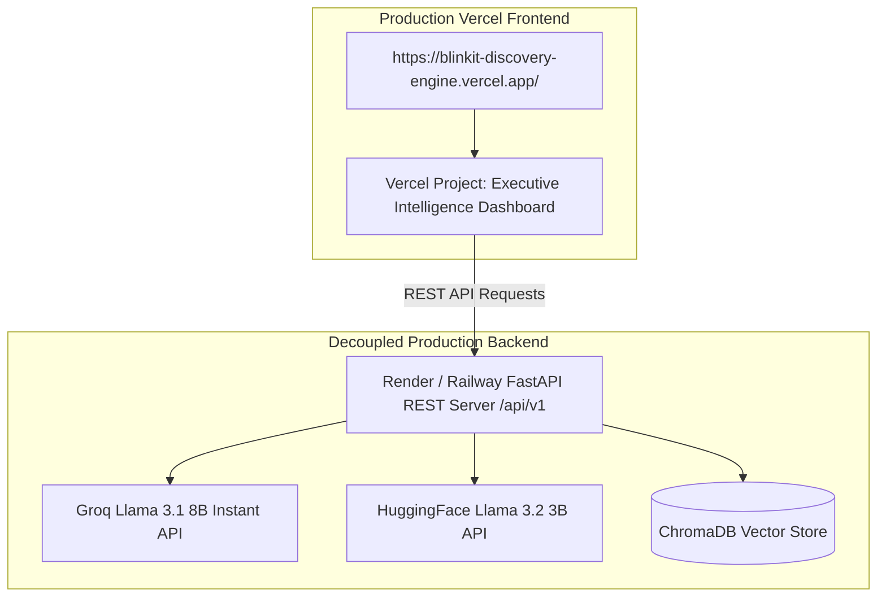

# Production Deployment Guide: Blinkit AI Discovery Engine

This document provides a comprehensive, step-by-step guide for deploying, configuring, securing, and maintaining the **Blinkit AI Discovery Engine Project**. It aligns directly with [context.md](file:///c:/Nextleap%20Projects%20Git/ProductManagerFellowshipGraduationProject/docs/context.md), [architecture.md](file:///c:/Nextleap%20Projects%20Git/ProductManagerFellowshipGraduationProject/docs/architecture.md), and [implementation-plan.md](file:///c:/Nextleap%20Projects%20Git/ProductManagerFellowshipGraduationProject/docs/implementation-plan.md).

---

## 1. Executive Deployment Strategy

The application is deployed as a high-availability platform consisting of a decoupled Python FastAPI backend service and a Vite React frontend:

> **Live Production Platform:** [https://blinkit-discovery-engine.vercel.app/](https://blinkit-discovery-engine.vercel.app/)

---

## 2. Deployment Topology

---

## 3. Environment Variables & Credentials Matrix

### 3.1 Backend Environment Variables (Render / Railway)

| Variable Name | Required | Default Value | Description |
|---|---|---|---|
| `LLM_PROVIDER` | Yes | `groq` | Primary LLM engine provider |
| `LLM_API_KEY` | Yes | — | Groq API Key for theme & insight synthesis |
| `LLM_MODEL` | Yes | `llama-3.1-8b-instant` | Groq LLM model name |
| `GROQ_API_KEY` | Optional | — | Explicit Groq API Key fallback |
| `HF_TOKEN` | Yes | — | Hugging Face token for Multi-LLM Consensus |
| `VECTOR_DB_PROVIDER` | Optional | `chroma` | Vector database engine |
| `PORT` | Yes | `8000` | Port exposed by Uvicorn server |

### 3.2 Frontend Environment Variables

* **Vercel Project:**
  - `VITE_API_URL` = `https://<your-backend-app>.onrender.com/api/v1`

---

## 4. Step-by-Step Deployment Guide

### Step 1: Backend Service Deployment (Render / Railway)
1. Connect repository to Render or Railway.
2. Select root directory build using `render.yaml` or `Dockerfile`.
3. Set environment variables (`GROQ_API_KEY`, `LLM_MODEL`).
4. Deploy and capture backend REST API URL (`https://<backend-service>.onrender.com`).

### Step 2: Frontend Deployment (Vercel)
1. Log into [Vercel.com](https://vercel.com) and click **Add New Project**.
2. Import the GitHub repository and select the frontend directory (`frontend/`).
3. Set environment variable: `VITE_API_URL=https://<backend-service>.onrender.com/api/v1`.
4. Deploy to generate the production link (`https://blinkit-discovery-engine.vercel.app/`).

---

## 5. Verification & Health Monitoring

1. **Verify Live Link:** Visit `https://blinkit-discovery-engine.vercel.app/` and confirm the Executive Intelligence Dashboard, research question filters, behavior graph, and interactive sandbox function without disruption.
2. **API Health Check:** Query `https://<backend-service>.onrender.com/health` to confirm healthy server status.
3. **API CORS Verification:** Ensure `fastapi.middleware.cors.CORSMiddleware` in `src/app/api_server.py` permits requests from Vercel subdomains.

---

*Document updated for NextLeap PM Fellowship Graduation Project*

